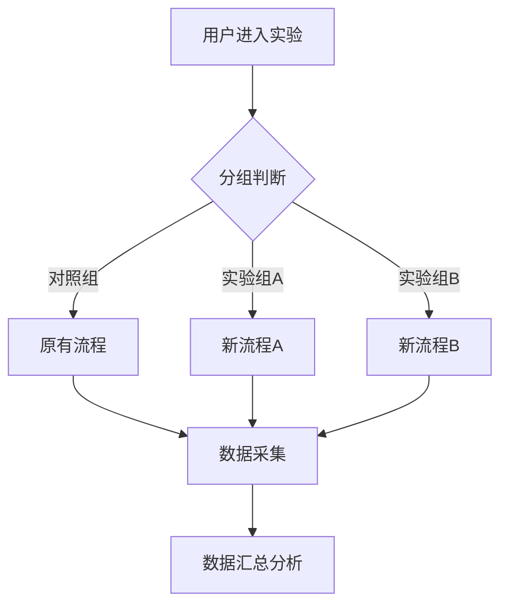

# 增长实验文档模板

## 1. 实验基本信息

| 字段 | 内容 |
|------|------|
| **实验名称** | [实验名称] |
| **实验ID** | [EXP-YYYYMMDD-001] |
| **实验类型** | [功能迭代/策略优化/A/B测试/灰度发布] |
| **业务目标** | [提升用户活跃度/增加转化率/提高留存率] |
| **负责人** | [姓名/部门] |
| **协作方** | [产品/研发/数据/运营] |
| **计划开始时间** | [YYYY-MM-DD] |
| **计划结束时间** | [YYYY-MM-DD] |
| **实际开始时间** | [待填写] |
| **实际结束时间** | [待填写] |

---

## 2. 实验背景与目标

### 2.1 背景
- 问题描述：[当前业务痛点或机会点]
- 数据支撑：[相关数据指标现状，如当前转化率、留存率等]
- 业务价值：[实验预期带来的业务价值]

### 2.2 目标设定

| 目标类型 | 目标描述 | 基准值 | 目标值 | 提升幅度 |
|----------|----------|--------|--------|----------|
| 核心目标 | [主要业务指标] | [当前值] | [目标值] | [X%] |
| 辅助目标 | [次要业务指标] | [当前值] | [目标值] | [X%] |
| 监控指标 | [风险监控指标] | [当前值] | [警戒值] | - |

### 2.3 假设与预期
- **假设**：[实验假设，如"优化成长值获取路径可提升用户活跃度"]
- **预期效果**：[预期带来的具体变化]
- **风险评估**：[可能的负面影响及应对方案]

---

## 3. 实验设计

### 3.1 实验对象与分组

| 分组 | 样本量 | 用户特征 | 分配方式 |
|------|--------|----------|----------|
| 对照组 | [数量/比例] | [用户画像描述] | [随机/定向] |
| 实验组A | [数量/比例] | [用户画像描述] | [随机/定向] |
| 实验组B | [数量/比例] | [用户画像描述] | [随机/定向] |

### 3.2 变量控制

| 变量类型 | 变量名称 | 对照组 | 实验组A | 实验组B |
|----------|----------|--------|----------|----------|
| 核心变量 | [变量1] | [值] | [值] | [值] |
| 核心变量 | [变量2] | [值] | [值] | [值] |
| 控制变量 | [变量] | [固定值] | [固定值] | [固定值] |

### 3.3 实验流程

### 3.4 实验范围
- **功能范围**：[涉及的功能模块]
- **用户范围**：[用户群体描述]
- **地域范围**：[覆盖地区]
- **设备范围**：[移动端/PC端/全平台]

---

## 4. 数据指标体系

### 4.1 核心指标

| 指标名称 | 计算公式 | 统计口径 | 数据来源 |
|----------|----------|----------|----------|
| 成长值获取率 | 获取成长值用户数/活跃用户数 | 每日/每周 | [数据库/埋点] |
| 等级晋升率 | 晋升用户数/符合条件用户数 | 每日/每周 | [数据库] |
| 任务完成率 | 完成任务数/领取任务数 | 每日/每周 | [数据库] |
| 用户活跃度 | 活跃用户数/总用户数 | 每日/每周 | [埋点/日志] |

### 4.2 辅助指标

| 指标名称 | 计算公式 | 统计口径 | 数据来源 |
|----------|----------|----------|----------|
| 页面访问量 | PV计数 | 每日 | [埋点] |
| 转化率 | 转化用户数/访问用户数 | 每日 | [埋点] |
| 留存率 | N日留存用户数/新增用户数 | 按周期 | [数据库] |
| 使用时长 | 总使用时长/活跃用户数 | 每日 | [埋点] |

### 4.3 风险监控指标

| 指标名称 | 告警阈值 | 告警方式 | 负责人 |
|----------|----------|----------|--------|
| 接口错误率 | >5% | 邮件/IM | [负责人] |
| 页面加载时间 | >3s | 邮件/IM | [负责人] |
| 用户投诉量 | >[阈值] | 邮件/IM | [负责人] |

---

## 5. 实验执行计划

### 5.1 时间安排

| 阶段 | 时间 | 任务 | 负责人 | 依赖 |
|------|------|------|--------|------|
| 需求评审 | [日期] | 实验方案评审 | [负责人] | - |
| 开发实现 | [日期] | 代码开发与自测 | [研发] | 需求确认 |
| 测试验证 | [日期] | 功能测试与回归 | [测试] | 开发完成 |
| 灰度发布 | [日期] | 小流量验证 | [运维] | 测试通过 |
| 全量上线 | [日期] | 正式发布 | [运维] | 灰度通过 |
| 数据观测 | [日期] | 数据监控分析 | [数据] | 上线完成 |
| 结果评估 | [日期] | 效果评估报告 | [负责人] | 数据足够 |

### 5.2 关键里程碑

| 里程碑 | 描述 | 时间节点 |
|--------|------|----------|
| M1 | 实验方案确定 | [日期] |
| M2 | 开发完成 | [日期] |
| M3 | 测试通过 | [日期] |
| M4 | 灰度启动 | [日期] |
| M5 | 全量上线 | [日期] |
| M6 | 数据复盘 | [日期] |

---

## 6. 实验配置与埋点

### 6.1 实验配置

| 配置项 | 值 | 说明 |
|--------|----|------|
| 实验开关 | [true/false] | 全局控制开关 |
| 流量比例 | [X%] | 参与实验用户比例 |
| 分组策略 | [随机/定向] | 用户分配方式 |
| 白名单 | [列表] | 测试用户ID |
| 版本号 | [X.X.X] | 实验版本标识 |

### 6.2 埋点设计

| 事件名称 | 事件代码 | 触发时机 | 携带参数 |
|----------|----------|----------|----------|
| 页面访问 | page_view | 页面加载完成 | page_name, timestamp |
| 按钮点击 | button_click | 按钮点击 | button_name, position |
| 任务领取 | task_receive | 用户领取任务 | task_id, task_name |
| 任务完成 | task_complete | 用户完成任务 | task_id, task_name, duration |
| 成长值获取 | growth_income | 获得成长值 | amount, source, description |
| 成长值消耗 | growth_expense | 消耗成长值 | amount, source, description |
| 等级晋升 | level_up | 用户等级提升 | from_level, to_level |

---

## 7. 数据分析计划

### 7.1 分析方法

| 分析维度 | 方法 | 工具 |
|----------|------|------|
| 对比分析 | 实验组vs对照组差异 | SQL/Analysis Platform |
| 相关性分析 | 指标间关联关系 | Python/R |
| 漏斗分析 | 转化路径分析 | BI工具 |
| 显著性检验 | 结果可靠性验证 | Python/R |

### 7.2 数据采集频率

| 指标类型 | 采集频率 | 存储周期 |
|----------|----------|----------|
| 实时监控 | 分钟级 | 7天 |
| 日报指标 | 每日 | 30天 |
| 周报指标 | 每周 | 永久 |

### 7.3 样本量计算

| 参数 | 值 | 说明 |
|------|----|------|
| 基准转化率 | [X%] | 当前指标值 |
| 预期提升 | [Y%] | 期望提升幅度 |
| 显著性水平 | 0.05 | 统计显著性 |
| 功效 | 0.8 | 检验功效 |
| 最小样本量 | [计算值] | 每组所需用户数 |

---

## 8. 风险与应急预案

### 8.1 风险识别

| 风险类型 | 风险描述 | 发生概率 | 影响程度 | 优先级 |
|----------|----------|----------|----------|--------|
| 技术风险 | [描述] | [高/中/低] | [高/中/低] | [P0/P1/P2] |
| 业务风险 | [描述] | [高/中/低] | [高/中/低] | [P0/P1/P2] |
| 数据风险 | [描述] | [高/中/低] | [高/中/低] | [P0/P1/P2] |

### 8.2 应急预案

| 风险场景 | 触发条件 | 应对措施 | 负责人 |
|----------|----------|----------|--------|
| 接口异常 | 错误率>5%持续5分钟 | 自动熔断，切回原有逻辑 | [运维] |
| 数据异常 | 指标波动>30% | 暂停实验，排查原因 | [数据] |
| 用户投诉激增 | 投诉量>阈值 | 立即回滚，安抚用户 | [运营] |

### 8.3 回滚方案

| 回滚类型 | 操作步骤 | 负责人 | 时间要求 |
|----------|----------|--------|----------|
| 快速回滚 | 关闭实验开关 | [运维] | 5分钟内 |
| 代码回滚 | 部署上一版本 | [运维] | 30分钟内 |
| 数据回滚 | 执行数据回滚脚本 | [研发] | 视数据量 |

---

## 9. 实验结果评估

### 9.1 结果摘要

| 指标 | 对照组 | 实验组A | 实验组B | 结论 |
|------|--------|----------|----------|------|
| [核心指标1] | [值] | [值] | [值] | [提升/下降/无变化] |
| [核心指标2] | [值] | [值] | [值] | [提升/下降/无变化] |
| [辅助指标1] | [值] | [值] | [值] | [提升/下降/无变化] |

### 9.2 统计显著性

| 指标 | 实验组A vs 对照组 | 实验组B vs 对照组 |
|------|-------------------|-------------------|
| [指标1] | p-value=[值] | p-value=[值] |
| [指标2] | p-value=[值] | p-value=[值] |

### 9.3 结论与建议

- **实验结论**：[是否达到预期目标]
- **最优方案**：[实验组A/B/原方案]
- **后续行动**：[全量推广/继续优化/终止实验]
- **经验教训**：[实验中的发现和改进点]

---

## 10. 附录

### 10.1 文档版本历史

| 版本 | 日期 | 修改内容 | 修改人 |
|------|------|----------|--------|
| V1.0 | [日期] | 初始版本 | [姓名] |
| V1.1 | [日期] | [修改说明] | [姓名] |

### 10.2 相关文档

- [关联文档1]
- [关联文档2]

### 10.3 参考资料

- [参考链接1]
- [参考链接2]
